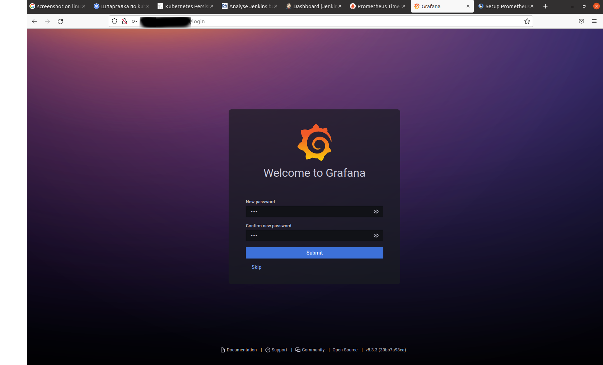
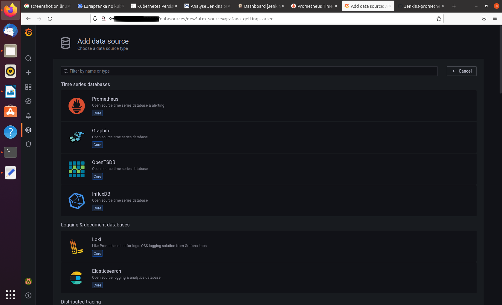
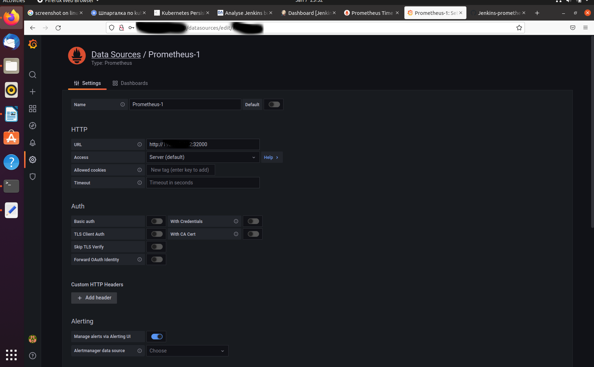
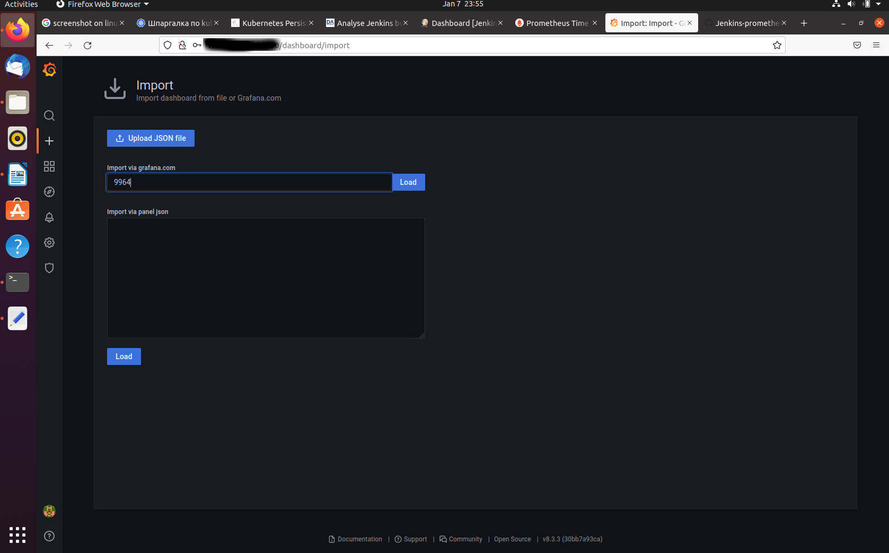
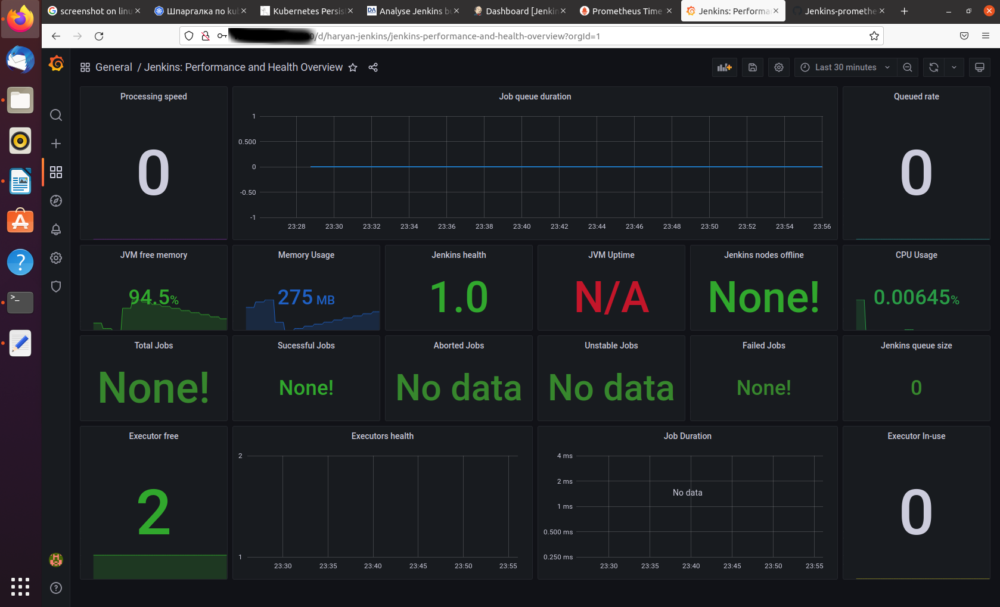

# Jenkins in Kubernetes monitoring with Prometheus and Graphana 

## Jenkins Deployment 


https://faun.pub/the-ci-octopus-extremely-scalable-jenkins-master-slaves-on-kubernetes-2607704a9513

### Prerequisites

Let’s first install kubectl via the Kubernetes website.

Next, let’s install minikube via the Minikube Kubernetes Page. They will ask you to install kubectl which you have already done. 

Let’s run a few commands… `minikube start` which you can confirm with minikube status. 

Setting up the Jenkins Master Repository

Let’s create some new local files.

***init.groovy***

This file is pretty important and was missing from a lot of the tutorials and sources we found. The tutorials explained how to configure the jenkins kubernetes plugin through the UI, running kubectl commands to get info for the config.

That is all fine and good, but what happens when the jenkins-master node goes down? The new pod will have a different IP and the kubernetes plugin will require different config and manual attention (not very kubernetes-style). That is where this script comes in. It is the “post-init” hook that Jenkins will fire when the instance first starts up… So let’s paste the following code into it.

```groovy

import org.csanchez.jenkins.plugins.kubernetes.*
import jenkins.model.*
def JENKINS_MASTER_PORT_50000_TCP_ADDR = System.env.JENKINS_MASTER_PORT_50000_TCP_ADDR
def JENKINS_MASTER_POD_IP = System.env.JENKINS_MASTER_POD_IP
def JENKINS_MASTER_SERVICE_PORT_HTTP = System.env.JENKINS_MASTER_SERVICE_PORT_HTTP
def JENKINS_SLAVE_AGENT_PORT = System.env.JENKINS_SLAVE_AGENT_PORT
def j = Jenkins.getInstance()
j.setNumExecutors(0)
def k = new KubernetesCloud(‘jenkins-master’)k.setJenkinsTunnel(JENKINS_MASTER_PORT_50000_TCP_ADDR+”:”+JENKINS_SLAVE_AGENT_PORT);

def proc = 'kubectl cluster-info | grep -Eom1 "https://(25[0-5]|2[0-4][0-9]|[01]?[0-9][0-9]?)\.(25[0-5]|2[0-4][0-9]|[01]?[0-9][0-9]?)\.(25[0-5]|2[0-4][0-9]|[01]?[0-9][0-9]?)\.(25[0-5]|2[0-4][0-9]|[01]?[0-9][0-9]?:[0-9]{1,3})"'.execute()
def b = new StringBuffer()
proc.consumeProcessErrorStream(b)

//println proc.text
println b.toString()

def YOUR_MIMIKUBE_HOST_URL=proc.text
k.setServerUrl(“${YOUR_MINIKUBE_HOST_URL}”);
k.setJenkinsUrl(“http://”+JENKINS_MASTER_POD_IP+”:”+JENKINS_MASTER_SERVICE_PORT_HTTP);
k.setNamespace(“default”);j.clouds.replace(k);
j.save();
```

What this script is doing is grabbing a number of environment variables that are available on the container, instantiating a new KubernetesCloud, formatting the variables, and assigning them to the correct properties for the kubernetes config.

The only value that you will have to add to this script is on the setServerURL call. This value YOUR_MINIKUBE_HOST_URL will be the output of the following command `kubectl cluster-info | grep -Eom1 "https://(25[0-5]|2[0-4][0-9]|[01]?[0-9][0-9]?)\.(25[0-5]|2[0-4][0-9]|[01]?[0-9][0-9]?)\.(25[0-5]|2[0-4][0-9]|[01]?[0-9][0-9]?)\.(25[0-5]|2[0-4][0-9]|[01]?[0-9][0-9]?:[0-9]{1,3})" ` In other cloud environments this URL will be static (not changing) and can be hard-coded or injected as a secret during the deployment.

As a side note here as much as possible, wherever possible, it is best to follow the infrastructure as code paradigm… Forcing yourself to operate outside a UI will pay dividends in the future when things go down or a new developer is attempting to grok your cloud infrastructure!

***Dockerfile***

Now we can build our jenkins-master container.

vi Dockerfile

Paste the following code into the Dockerfile and read through the comments to get an understanding of what we are installing on to the image. The most important plugins are the ssh-slaves, kubernetes, and workflow-aggregator plugins.

```Dockerfile
    
    FROM jenkins/jenkins:lts
    # Distributed Builds plugins (managing slaves)
    RUN /usr/local/bin/install-plugins.sh ssh-slaves
    # install Notifications and Publishing plugins (unused at the moment)
    RUN /usr/local/bin/install-plugins.sh slack
    # UI 
    RUN /usr/local/bin/install-plugins.sh greenballs
    # Scaling (main plugin)
    RUN /usr/local/bin/install-plugins.sh kubernetes
    #GitHub Integration (not used but important)
    RUN /usr/local/bin/install-plugins.sh github
    #Pipeline for creating pipeline jobs
    RUN /usr/local/bin/install-plugins.sh workflow-aggregator
    #Metrics plugin for Jenkins
    RUN /usr/local/bin/install-plugins.sh metrics
    #Jenkins Prometheus Plugin expose an endpoint (default /prometheus) with metrics where a Prometheus Server can scrape.
    RUN /usr/local/bin/install-plugins.sh prometheus:2.0.10
    #Jenkins test result aggregator https://github.com/jenkinsci/test-results-aggregator-plugin
    RUN /usr/local/bin/install-plugins.sh test-results-aggregator
    #Jenkins test result analizer https://github.com/jenkinsci/test-results-analizer
    RUN /usr/local/bin/install-plugins.sh test-results-analyzer:0.3.5
    #Jenkins logstash plugin https://github.com/jenkinsci/logstash-plugin
    RUN /usr/local/bin/install-plugins.sh logstash
    #Groovy post-init script
    COPY init.groovy /usr/share/jenkins/ref/init.groovy.d/init.groovy
    USER jenkins

```

If you like you can collapse all the plugin installs into a single command a la..

`RUN /usr/local/bin/install-plugins.sh ssh-slaves slack greenballs kubernetes github workflow-aggregator`

Before finishing the docker stuff let’s run one more command to build our image with our desired tag.

`docker build -t jenkins-master:1.0 .`

### Kubernetes Pod Deployment

Create namespace vi `jenkins-master-deployment.yaml` and paste the following code into it.

```yaml

apiVersion: v1
kind: Namespace
metadata:
  name: jenkins

```

Lets run this command, vi `jenkins-master-deployment.yaml` and paste the following code into it…

```yaml

apiVersion: apps/v1
kind: Deployment
metadata:
  name: jenkins-master
  namespace: jenkins
spec:
  replicas: 1
  selector:
    matchLabels:
      app: jenkins-master
  strategy:
    type: Recreate
  template:
    metadata:
      labels:
        app: jenkins-master
    spec:
      serviceAccountName: default
      securityContext: # Set runAsUser to 1000 to let Jenkins run as non-root user 'jenkins' which exists in 'jenkins/jenkins'
        runAsUser: 0
        fsGroup: 1000        
      containers:
        - name: jenkins
          image: vieskov1980/jenkins-master:1.0
          imagePullPolicy: IfNotPresent #Never
          env:
            - name: JAVA_OPTS
              value: -Djenkins.install.runSetupWizard=false
            - name: JENKINS_MASTER_POD_IP
              valueFrom:
                fieldRef:
                  fieldPath: status.podIP
          ports:
            - name: http-port
              containerPort: 8080
            - name: jnlp-port
              containerPort: 50000
          volumeMounts:
            - name: jenkins-home
              mountPath: "/var/jenkins_home"
      volumes:
        #- name: jenkins-home
          #emptyDir: {}
      - name: jenkins-home
        persistentVolumeClaim:
          claimName: pvc-jenkins-home
      restartPolicy: Always  

```  

Most of the code above the spec object is standard. We are going to name the pod jenkins-master with a Recreate deployment strategy. Once we get into the spec object there are a couple important things going on. The serviceAccountName is the account we will give permissions to be able to interact with the kubernetes API. The image property will be the name of the container that we built in the previous docker-build step as the -t argument jenkins-master.

We add in two environment variables, one that disables the Jenkins setup wizard and will auto-setup Jenkins on container spin-up, the second is the ip of the pod once it has spun up injected as status.podIP. We expose two ports 8080 for external traffic to Jenkins and 50000 because is the default port for the jnlp-slaves communication.
Kubernetes Service

Now that we have the deployment lets create the kubernetes service with a `vi jenkins-master-service.yaml` pasting the following code into it...

```yaml

apiVersion: v1
kind: Service
metadata:
  name: jenkins-master
  namespace: jenkins
spec:
  type: NodePort
  ports:
    - port: 8080
      name: "http"
      nodePort: 30000
      targetPort: 8080
    - port: 50000
      name: "slave"
      nodePort: 30010
      targetPort: 50000
  selector:
    app: jenkins-master

```

This will tell kubernetes to how to access the pod defined in our deployment. nodePort is what the service takes in traffic on and targetPort is the port exposed on the container. We open up port 8080 for incoming traffic and 50000 for communication with the jenkins-slaves instances. When we go to hit the Jenkins URL within minikube, we will use port 30000. Incoming traffic on the node flows from port 30000 to 8080 on the jenkins-master container.
Kubernetes ClusterRole

Last, but certainly not least we have to give some permissions to the default serviceAccount we added to our deployment. Let’s run the following command `vi jenkins-master-role.yaml` and paste the following…

```yaml

apiVersion: rbac.authorization.k8s.io/v1
kind: ClusterRole
metadata:
  namespace: jenkins
  name: service-reader
rules:
  - apiGroups: [""]
    resources: ["services"]
    verbs: ["get", "watch", "list"]
  - apiGroups: [""]
    resources: ["pods"]
    verbs: ["create", "delete", "get", "list", "patch", "update", "watch"]
  - apiGroups: [""]
    resources: ["pods/exec"]
    verbs: ["create", "delete", "get", "list", "patch", "update", "watch"]
  - apiGroups: [""]
    resources: ["pods/log"]
    verbs: ["get", "list", "watch"]
  - apiGroups: [""]
    resources: ["secrets"]
    verbs: ["get"]

```

This role will allow our jenkins-master to provision slaves via the Kubernetes API. The apiGroups: [""] refers to the core API group. Next, vi jenkins-master-role-binding.yaml and paste in the following…

```yaml

kind: ClusterRoleBinding
apiVersion: rbac.authorization.k8s.io/v1
metadata:
  name: service-reader-pod
subjects:
  - kind: ServiceAccount
    name: default
    namespace: jenkins
roleRef:
  kind: ClusterRole
  name: service-reader
  apiGroup: rbac.authorization.k8s.io.

```

This will bind our new ClusterRole service-reader to the default service account listed in our `jenkins-master-deployment.yaml`.

Create persistent volume and persistent volume claims `vi volumes.yaml`.

```yaml
---
apiVersion: v1
kind: PersistentVolume
metadata:
  name: jenkins-home
  namespace: jenkins
  labels:
    type: local
spec:
  storageClassName: "" #local-hostpath-storage 
  accessModes:
    - ReadWriteOnce
  capacity:
    storage: 20Gi
  persistentVolumeReclaimPolicy: Retain  
  hostPath:
    path: "/data/jenkins_home"
    #type: DirectoryOrCreate

---
kind: PersistentVolumeClaim
apiVersion: v1
metadata:
  name: pvc-jenkins-home
  namespace: jenkins
spec:
  accessModes:
    - ReadWriteOnce
  storageClassName: "" #local-hostpath-storage
  volumeName: jenkins-home
  resources:
    requests:
      storage: 10Gi

```

### Deploy Jenkins and Test

Theres no more to do! Time to deploy to the K8s baby!

`kubectl apply -f .`

You should see the following output to confirm the success.

```
deployment.apps/jenkins-master created
clusterrolebinding.rbac.authorization.k8s.io/service-reader-pod created
clusterrole.rbac.authorization.k8s.io/service-reader created
service/jenkins-master created

```

If so, mega congrats! We are almost there.

Go ahead and visit the url generated from the following command.

echo “http://$(minikube ip):30000”

This should get you to the Jenkins UI. From here we will click on “create new job”, type in a name, “Test Job 1”, choose type “pipeline”, and click “OK”.

On the left hand side click on configure and scroll down to the pipeline groovy editor and paste the following snippet.

```groovy

def POD_LABEL = "testpod"
podTemplate(label:POD_LABEL, cloud: "jenkins-master", containers: [
    containerTemplate(name: 'build', image: 'node:12.13.1', ttyEnabled: true, command: 'cat')
  ]) {
    node(POD_LABEL) {
        stage('Run Shell') {
            container('build') {
                sh "sleep 30"
            }
        }
    }
}

```

Save and click “Build Now”, then navigate “Back to Dashboard” [1b], [2b], [3b], [6b], [7b], [8b], [9b].


## How to Setup Prometheus Monitoring On Kubernetes Cluster

Let’s get started with the setup.
Create a Namespace & ClusterRole

First, we will create a Kubernetes namespace for all our monitoring components. If you don’t create a dedicated namespace, all the Prometheus kubernetes deployment objects get deployed on the default namespace.

Create a new namespace named monitoring `vi prometheus-ns.yaml`

```yaml

apiVersion: v1
kind: Namespace
metadata:
  name: monitoring

```

Prometheus uses Kubernetes APIs to read all the available metrics from Nodes, Pods, Deployments, etc. For this reason, we need to create an RBAC policy with read access to required API groups and bind the policy to the monitoring namespace.

Create a file named `clusterRole.yaml` and copy the following RBAC role.

In the role, given below, you can see that we have added get, list, and watch permissions to nodes, services endpoints, pods, and ingresses. The role binding is bound to the monitoring namespace. If you have any use case to retrieve metrics from any other object, you need to add that in this cluster role.

```yaml

apiVersion: rbac.authorization.k8s.io/v1
kind: ClusterRole
metadata:
  name: prometheus
rules:
- apiGroups: [""]
  resources:
  - nodes
  - nodes/proxy
  - services
  - endpoints
  - pods
  verbs: ["get", "list", "watch"]
- apiGroups:
  - extensions
  resources:
  - ingresses
  verbs: ["get", "list", "watch"]
- nonResourceURLs: ["/metrics"]
  verbs: ["get"]
---
apiVersion: rbac.authorization.k8s.io/v1
kind: ClusterRoleBinding
metadata:
  name: prometheus
roleRef:
  apiGroup: rbac.authorization.k8s.io
  kind: ClusterRole
  name: prometheus
subjects:
- kind: ServiceAccount
  name: default
  namespace: monitoring

```

Create the role using the following command.

`kubectl create -f clusterRole.yaml`

Create a Config Map To Externalize Prometheus Configurations

All configurations for Prometheus are part of prometheus.yaml file and all the alert rules for Alertmanager are configured in prometheus.rules.

`prometheus.yml`: This is the main Prometheus configuration which holds all the scrape configs, service discovery details, storage locations, data retention configs, etc)
prometheus.rules: This file contains all the Prometheus alerting rules

By externalizing Prometheus configs to a Kubernetes config map, you don’t have to build the Prometheus image whenever you need to add or remove a configuration. You need to update the config map and restart the Prometheus pods to apply the new configuration.

The config map with all the Prometheus scrape config and alerting rules gets mounted to the Prometheus container in /etc/prometheus location as prometheus.yaml and prometheus.rules files.

Create a file called `config-map.yaml`.

```yaml

apiVersion: v1
kind: ConfigMap
metadata:
  name: prometheus-server-conf
  labels:
    name: prometheus-server-conf
  namespace: monitoring
data:
  prometheus.rules: |-
    groups:
    - name: devopscube demo alert
      rules:
      - alert: High Pod Memory
        expr: sum(container_memory_usage_bytes) > 1
        for: 1m
        labels:
          severity: slack
        annotations:
          summary: High Memory Usage
  prometheus.yml: |-
    global:
      scrape_interval: 5s
      evaluation_interval: 5s
    rule_files:
      - /etc/prometheus/prometheus.rules
    alerting:
      alertmanagers:
      - scheme: http
        static_configs:
        - targets:
          - "alertmanager.monitoring.svc:9093"

    scrape_configs:
      - job_name: 'jenkins'
        metrics_path: /prometheus
        static_configs:
          - targets: ['MINIKUBE_IP:30000'] #JENKINS URL 

      - job_name: 'node-exporter'
        kubernetes_sd_configs:
          - role: endpoints
        relabel_configs:
        - source_labels: [__meta_kubernetes_endpoints_name]
          regex: 'node-exporter'
          action: keep
      
      - job_name: 'kubernetes-apiservers'

        kubernetes_sd_configs:
        - role: endpoints
        scheme: https

        tls_config:
          ca_file: /var/run/secrets/kubernetes.io/serviceaccount/ca.crt
        bearer_token_file: /var/run/secrets/kubernetes.io/serviceaccount/token

        relabel_configs:
        - source_labels: [__meta_kubernetes_namespace, __meta_kubernetes_service_name, __meta_kubernetes_endpoint_port_name]
          action: keep
          regex: default;kubernetes;https

      - job_name: 'kubernetes-nodes'

        scheme: https

        tls_config:
          ca_file: /var/run/secrets/kubernetes.io/serviceaccount/ca.crt
        bearer_token_file: /var/run/secrets/kubernetes.io/serviceaccount/token

        kubernetes_sd_configs:
        - role: node

        relabel_configs:
        - action: labelmap
          regex: __meta_kubernetes_node_label_(.+)
        - target_label: __address__
          replacement: kubernetes.default.svc:443
        - source_labels: [__meta_kubernetes_node_name]
          regex: (.+)
          target_label: __metrics_path__
          replacement: /api/v1/nodes/${1}/proxy/metrics     
      
      - job_name: 'kubernetes-pods'

        kubernetes_sd_configs:
        - role: pod

        relabel_configs:
        - source_labels: [__meta_kubernetes_pod_annotation_prometheus_io_scrape]
          action: keep
          regex: true
        - source_labels: [__meta_kubernetes_pod_annotation_prometheus_io_path]
          action: replace
          target_label: __metrics_path__
          regex: (.+)
        - source_labels: [__address__, __meta_kubernetes_pod_annotation_prometheus_io_port]
          action: replace
          regex: ([^:]+)(?::\d+)?;(\d+)
          replacement: $1:$2
          target_label: __address__
        - action: labelmap
          regex: __meta_kubernetes_pod_label_(.+)
        - source_labels: [__meta_kubernetes_namespace]
          action: replace
          target_label: kubernetes_namespace
        - source_labels: [__meta_kubernetes_pod_name]
          action: replace
          target_label: kubernetes_pod_name
      
      - job_name: 'kube-state-metrics'
        static_configs:
          - targets: ['kube-state-metrics.kube-system.svc.cluster.local:8080']

      - job_name: 'kubernetes-cadvisor'

        scheme: https

        tls_config:
          ca_file: /var/run/secrets/kubernetes.io/serviceaccount/ca.crt
        bearer_token_file: /var/run/secrets/kubernetes.io/serviceaccount/token

        kubernetes_sd_configs:
        - role: node

        relabel_configs:
        - action: labelmap
          regex: __meta_kubernetes_node_label_(.+)
        - target_label: __address__
          replacement: kubernetes.default.svc:443
        - source_labels: [__meta_kubernetes_node_name]
          regex: (.+)
          target_label: __metrics_path__
          replacement: /api/v1/nodes/${1}/proxy/metrics/cadvisor
      
      - job_name: 'kubernetes-service-endpoints'

        kubernetes_sd_configs:
        - role: endpoints

        relabel_configs:
        - source_labels: [__meta_kubernetes_service_annotation_prometheus_io_scrape]
          action: keep
          regex: true
        - source_labels: [__meta_kubernetes_service_annotation_prometheus_io_scheme]
          action: replace
          target_label: __scheme__
          regex: (https?)
        - source_labels: [__meta_kubernetes_service_annotation_prometheus_io_path]
          action: replace
          target_label: __metrics_path__
          regex: (.+)
        - source_labels: [__address__, __meta_kubernetes_service_annotation_prometheus_io_port]
          action: replace
          target_label: __address__
          regex: ([^:]+)(?::\d+)?;(\d+)
          replacement: $1:$2
        - action: labelmap
          regex: __meta_kubernetes_service_label_(.+)
        - source_labels: [__meta_kubernetes_namespace]
          action: replace
          target_label: kubernetes_namespace
        - source_labels: [__meta_kubernetes_service_name]
          action: replace
          target_label: kubernetes_name

```

Execute the following command to create the config map in Kubernetes.

`kubectl create -f config-map.yaml`

It creates two files inside the container.

Note: In Prometheus terms, the config for collecting metrics from a collection of endpoints is called a job. 

The prometheus.yml contains all the configurations to discover pods and services running in the Kubernetes cluster dynamically. We have the following scrape jobs in our Prometheus scrape configuration.
```YAML
    kubernetes-apiservers: It gets all the metrics from the API servers.
    kubernetes-nodes: It collects all the kubernetes node metrics.
    kubernetes-pods: All the pod metrics get discovered if the pod metadata is annotated with prometheus.io/scrape and prometheus.io/port annotations.
    kubernetes-cadvisor: Collects all cAdvisor metrics.
    kubernetes-service-endpoints: All the Service endpoints are scrapped if the service metadata is annotated with prometheus.io/scrape and prometheus.io/port annotations. It can be used for black-box monitoring.
```
prometheus.rules contains all the alert rules for sending alerts to the Alertmanager.

Create a Prometheus Deployment

Create a file named prometheus-deployment.yaml and copy the following contents onto the file. In this configuration, we are mounting the Prometheus config map as a file inside /etc/prometheus as explained in the previous section.

Note: This deployment uses the latest official Prometheus image from the docker hub. Also, we are not using any persistent storage volumes for Prometheus storage as it is a basic setup. When setting up Prometheus for production uses cases, make sure you add persistent storage to the deployment.

```yaml

apiVersion: apps/v1
kind: Deployment
metadata:
  name: prometheus-deployment
  namespace: monitoring
  labels:
    app: prometheus-server
spec:
  replicas: 1
  selector:
    matchLabels:
      app: prometheus-server
  template:
    metadata:
      labels:
        app: prometheus-server
    spec:
      containers:
        - name: prometheus
          image: prom/prometheus
          args:
            - "--config.file=/etc/prometheus/prometheus.yml"
            - "--storage.tsdb.path=/prometheus/"
          ports:
            - containerPort: 9090
          volumeMounts:
            - name: prometheus-config-volume
              mountPath: /etc/prometheus/
            - name: prometheus-storage-volume
              mountPath: /prometheus/
      volumes:
        - name: prometheus-config-volume
          configMap:
            defaultMode: 420
            name: prometheus-server-conf
  
        - name: prometheus-storage-volume
          emptyDir: {}

```

Create a deployment on monitoring namespace using the above file.

`kubectl create  -f prometheus-deployment.yaml `

You can check the created deployment using the following command.

`kubectl get deployments --namespace=monitoring`


You can view the deployed Prometheus dashboard in three different ways.

Using Kubectl port forwarding
Exposing the Prometheus deployment as a service with NodePort or a Load Balancer.
Adding an Ingress object if you have an Ingress controller deployed.

To access the Prometheus dashboard over a IP or a DNS name, you need to expose it as Kubernetes service.
Create a file named prometheus-service.yaml and copy the following contents. We will expose Prometheus on all kubernetes node IP’s on port 30000.

Note: If you are on AWS, Azure, or Google Cloud, You can use Loadbalancer type, which will create a load balancer and automatically points it to the Kubernetes service endpoint.

```yaml

apiVersion: v1
kind: Service
metadata:
  name: prometheus-service
  namespace: monitoring
  annotations:
      prometheus.io/scrape: 'true'
      prometheus.io/port:   '9090'
  
spec:
  selector: 
    app: prometheus-server
  type: NodePort  
  ports:
    - port: 8080
      targetPort: 9090 
      nodePort: 32000

```

The annotations in the above service YAML makes sure that the service endpoint is scrapped by Prometheus. The prometheus.io/port should always be the target port mentioned in service YAML

Create the service using the following command.

`kubectl create -f prometheus-service.yaml --namespace=monitoring`

Step 3: Once created, you can access the Prometheus dashboard using any of the Kubernetes nodes IP on port 30000. If you are on the cloud, make sure you have the right firewall rules to access port 30000 from your workstation [4b], [5b].

## How To Setup Grafana On Kubernetes

Let’s look at the Grafana setup in detail.

Create file named `grafana-datasource-config.yaml`

`vi grafana-datasource-config.yaml`

Copy the following contents.

Note: The following data source configuration is for Prometheus. If you have more data sources, you can add more data sources with different YAMLs under the data section.

```yaml

apiVersion: v1
kind: ConfigMap
metadata:
  name: grafana-datasources
  namespace: monitoring
data:
  prometheus.yaml: |-
    {
        "apiVersion": 1,
        "datasources": [
            {
               "access":"proxy",
                "editable": true,
                "name": "prometheus",
                "orgId": 1,
                "type": "prometheus",
                "url": "http://prometheus-service.monitoring.svc:8080",
                "version": 1
            }
        ]
    }

  ```

Create the configmap using the following command.

`kubectl create -f grafana-datasource-config.yaml`

Create a file named `deployment.yaml`

`vi deployment.yaml`

Copy the following contents on the file.

```yaml

apiVersion: apps/v1
kind: Deployment
metadata:
  name: grafana
  namespace: monitoring
spec:
  replicas: 1
  selector:
    matchLabels:
      app: grafana
  template:
    metadata:
      name: grafana
      labels:
        app: grafana
    spec:
      containers:
      - name: grafana
        image: grafana/grafana:latest
        ports:
        - name: grafana
          containerPort: 3000
        resources:
          limits:
            memory: "1Gi"
            cpu: "1000m"
          requests: 
            memory: 500M
            cpu: "500m"
        volumeMounts:
          - mountPath: /var/lib/grafana
            name: grafana-storage
          - mountPath: /etc/grafana/provisioning/datasources
            name: grafana-datasources
            readOnly: false
      volumes:
        - name: grafana-storage
          emptyDir: {}
        - name: grafana-datasources
          configMap:
              defaultMode: 420
              name: grafana-datasources

  ```

Note: This Grafana deployment does not use a persistent volume. If you restart the pod all changes will be gone. Use a persistent volume if you are deploying Grafana for your project requirements. It will persist all the configs and data that Grafana uses.

Create the deployment

`kubectl create -f deployment.yaml`

Create a service file named `service.yaml`

`vi service.yaml`

Copy the following contents. This will expose Grafana on NodePort 32000. You can also expose it using ingress or a Loadbalancer based on your requirement.

```yaml

apiVersion: v1
kind: Service
metadata:
  name: grafana
  namespace: monitoring
  annotations:
      prometheus.io/scrape: 'true'
      prometheus.io/port:   '3000'
spec:
  selector: 
    app: grafana
  type: NodePort  
  ports:
    - port: 3000
      targetPort: 3000
      nodePort: 32500

```

Create the service.

`kubectl create -f service.yaml`

Now you should be able to access the Grafana dashboard using any node IP on port 32500. Make sure the port is allowed in the firewall to be accessed from your workstation.

http://<your-node-ip>:32500


Use the following default username and password to log in. Once you log in with default credentials, it will prompt you to change the default password.

User: admin
Pass: admin




### Setup Kubernetes Jenkins monitoring on Grafana

Step 1: Create data source for Prometheus.



Step 2: Enter Jenkins IP 



Step 4: Enter the dashboard ID: 9964. Grafana will automatically fetch the template from Grafana website. 



You should see the dashboard immediately [11b].




## Deploy an Elasticsearch cluster

Apply a simple Elasticsearch cluster specification, with one Elasticsearch node:

If your Kubernetes cluster does not have any Kubernetes nodes with at least 2GiB of free memory, the pod will be stuck in Pending state. See Manage compute resources for more information about resource requirements and how to configure them.

Create namespace logging. `vi elk-ns.yaml`

```yaml
apiVersion: v1
kind: Namespace
metadata:
  name: logging

```

Run command: `kubectl create -f elk-ns.yaml`

We’ll start with Elasticsearch [45b], [46b], [47b].

`vi elastic.yaml`

```yaml

apiVersion: apps/v1
kind: Deployment
metadata:
  name: elasticsearch
spec:
  selector:
    matchLabels:
      component: elasticsearch
  template:
    metadata:
      labels:
        component: elasticsearch
    spec:
      containers:
      - name: elasticsearch
        image: docker.elastic.co/elasticsearch/elasticsearch:7.16.2
        env:
        - name: discovery.type
          value: single-node
        ports:
        - containerPort: 9200
          name: http
          protocol: TCP
        resources:
          limits:
            cpu: 500m
            memory: 4Gi
          requests:
            cpu: 500m
            memory: 2Gi

---

apiVersion: v1
kind: Service
metadata:
  name: elasticsearch
  labels:
    service: elasticsearch
spec:
  type: NodePort
  selector:
    component: elasticsearch
  ports:
  - port: 9200
    targetPort: 9200
    nodePort: 30920

```

`kubectl create -f elastic.yaml -n logging`

`kubectl get pods -n logging`

`kubectl get service -n logging`

Next, let’s get Kibana up and running. [45b], [46b], [47b]

`vi kibana.yaml`


```yaml

apiVersion: apps/v1
kind: Deployment
metadata:
  name: kibana
spec:
  selector:
    matchLabels:
      run: kibana
  template:
    metadata:
      labels:
        run: kibana
    spec:
      containers:
      - name: kibana
        image: docker.elastic.co/kibana/kibana:7.16.2
        env:
        - name: ELASTICSEARCH_URL
          value: http://MINIKUBE_IP:30920                                             
        - name: XPACK_SECURITY_ENABLED
          value: "true"
        ports:
        - containerPort: 5601
          name: http
          protocol: TCP

---

apiVersion: v1
kind: Service
metadata:
  name: kibana
  labels:
    service: kibana
spec:
  type: NodePort
  selector:
    run: kibana
  ports:
  - port: 5601
    targetPort: 5601
    nodePort: 30601

```

`kubectl create -f kibana.yaml -n logging`

`kubectl get pods -n logging`

`kubectl get service -n logging`


## Monitor Jenkins Application Logs using ELK Stack

We will use ELK Stack (Elasticsearch, Logstash, and Kibana) and Filebeat, to ship logs from the Jenkins server and create a fancy dashboard to visualize them in real-time. Below is the architecture of what we want to achieve.


    *  **Beats**: We will use Metricbeat, to ship the Jenkins Application Logs located at the path /var/log/jenkins/jenkins.log for Linux based machines.

    *  **Logstash**: Logstash will ingest the logs sent from Metricbeat and parse the logs, dynamically transform data irrespective of format and complexity, using different filter plugins.

    *  **Elasticsearch**: Elasticsearch will store the parsed logs sent from Logstash and index it in a way that supports fast searches. It provides real-time search and analytics of all types of data.

    *  **Kibana**: Kibana uses Elasticsearch as a data source to visualize data. It has a rich source of different visualization like charts, graphs, GeoIP Map, etc. It can be referred to as a search dashboard for Elasticsearch.


### Configuring Logstash

Logstash process events in three stages: input → filter → output. In this case,

    input: get logs data from filebeat
    filter: used grok, date, and mutate filter plugins to filter and process logs
    output: store the processed logs in elasticsearch

Create file `vi logstash-deployment.yaml` [43b], [44b].

```yaml

apiVersion: v1
kind: ConfigMap
metadata:
  name: logstash-configmap
  namespace: logging
data:
  logstash.yml: |
    http.host: "0.0.0.0"
    path.config: /usr/share/logstash/pipeline
  logstash.conf: |
    input {
      beats {
        port => "5044"
      }
    }
    
    filter {
      if [type] == "jenkins-server" {
      # set all messages from the jenkins log as type 'jenkins' and add the @message field.
          mutate {
              add_field => ["@message_type", "jenkins"]
              add_field => ["@message", "%{message}"]
          }
        }
      }
    # now that we have possibly-multiline events, we can clean them up.
    filter {
    # munge the possibly-multiline messages into a single string
        mutate {
          join => ["@message", "\n"]
        }
    # split @message into __date and __msg, and overwrite the @timestamp value.
      grok {
          match => [ "@message", "^(?<__date>%{MONTH} %{MONTHDAY}, %{YEAR} %{TIME} (AM|PM)) (?<__msg>.+)" ]
      }
      date {
          match  => [ "__date", "MMM dd, YYYY HH:mm:ss a"]
      }
    # ...now some patterns to categorize specific event types...
    # parse build completion messages, adding the jenkins_* fields and the 'build' tag
      grok {
          match => [ "@message", "(?<jenkins_job>\S+) #(?<jenkins_build_number>\d+) (?<__msg>.+): (?<jenkins_build_status>\w+)" ]
          tag_on_failure => []
          overwrite => true
          add_tag => ['build']
      }
       
    # convert build number from string to integer
      mutate {
        convert => ["jenkins_build_number", "integer"]
      }
    # tag messages that come from the perforce SCM plugin (and associated classes)
      grok {
        match => [ "@message", "\.perforce\."]
        tag_on_failure => []
        add_tag => ['p4-plugin']
      }
    # if we have extracted a short message string, replace @message with it now
      if [__msg] {
        mutate {
          replace => ["@message","%{__msg}"]
        }
      }
    # convert @message back into an array of lines
        mutate {
          split => ["@message", "\n"]
        }
    }
    # clean-up temporary fields and unwanted tags.
    filter {
      mutate {
        remove_field => [
          "message",
          "__msg",
          "__date",
          "dumps1",
          "plugin_command"
        ]
        remove_tag => [
          "multiline",
          "_grokparsefailure"
        ]
      }
    }
    # send it on to the elasticsearch
    output {
      elasticsearch {
        hosts =>   ["ELASTICSEARCH_INTERNAL_IP:9200"]                                                #
    
    # username & password to connect to elaticsearch
        user => "elastic"
        password =>  "changeme"         #"elastic"
    
        action => "index"
        index => "jenkins-%{+YYYY.MM.dd}"}
 
    # use this if you want to verify logs are being sent to elasticsearch or not
 
    #stdout { codec => rubydebug }
    }
---
apiVersion: apps/v1
kind: Deployment
metadata:
  name: logstash-deployment
  namespace: logging
spec:
  replicas: 1
  selector:
    matchLabels:
      app: logstash
  template:
    metadata:
      labels:
        app: logstash
    spec:
      containers:
      - name: logstash
        image: docker.elastic.co/logstash/logstash:7.16.2
        ports:
        - containerPort: 5044
        volumeMounts:
          - name: config-volume
            mountPath: /usr/share/logstash/config
          - name: logstash-pipeline-volume
            mountPath: /usr/share/logstash/pipeline
      volumes:
      - name: config-volume
        configMap:
          name: logstash-configmap
          items:
            - key: logstash.yml
              path: logstash.yml
      - name: logstash-pipeline-volume
        configMap:
          name: logstash-configmap
          items:
            - key: logstash.conf
              path: logstash.conf
---
kind: Service
apiVersion: v1
metadata:
  name: logstash-service
  namespace: logging
spec:
  selector:
    app: logstash
  ports:
  - protocol: TCP
    port: 5044
    targetPort: 5044
  type: ClusterIP

```
`vi logstash-pipeline-test.groovy`

```groovy

pipeline{
    agent none
    stages {
        stage("first"){
            steps {
                
                      logstash{ 
                       echo "hello world 1"
                      }
                  
                
            }
        }
        stage("second"){
            steps{
                
                    logstash {
                        echo "hello world 2"
                    }
                
            }
        }
    }
}

```

### Configuring Metricbeat

Metricbeat is a lightweight logs shipper. It is installed as an agent on your servers (i.e. Jenkins server) which will monitor the Jenkins log file, collect events, and ships to Logstash for parsing [43b], [45b]. 


Below is the file `vi metricbeat-kubernetes.yaml`

```yaml
---
apiVersion: v1
kind: ConfigMap
metadata:
  name: metricbeat-daemonset-config
  namespace: logging
  labels:
    k8s-app: metricbeat
data:
  metricbeat.yml: |-
    setup.dashboards.enabled: true #https://www.elastic.co/guide/en/beats/metricbeat/current/configuration-dashboards.html
    setup.dashboard.beat: metricbeat
    setup.kibana.host: "http://minikube_ip:30601"                 
    ##############################
    metricbeat.config.modules:
      # Mounted `metricbeat-daemonset-modules` configmap:
      path: ${path.config}/modules.d/*.yml
      # Reload module configs as they change:
      reload.enabled: false
    metricbeat.autodiscover:
      providers:
        - type: kubernetes
          scope: cluster
          node: ${NODE_NAME}
          # In large Kubernetes clusters consider setting unique to false
          # to avoid using the leader election strategy and
          # instead run a dedicated Metricbeat instance using a Deployment in addition to the DaemonSet
          unique: true
          templates:
            - config:
                - module: kubernetes
                  hosts: ["kube-state-metrics:8080"]
                  period: 10s
                  add_metadata: true
                  metricsets:
                    - state_node
                    - state_deployment
                    - state_daemonset
                    - state_replicaset
                    - state_pod
                    - state_container
                    - state_job
                    - state_cronjob
                    - state_resourcequota
                    - state_statefulset
                    - state_service
                - module: kubernetes
                  metricsets:
                    - apiserver
                  hosts: ["https://${KUBERNETES_SERVICE_HOST}:${KUBERNETES_SERVICE_PORT}"]
                  bearer_token_file: /var/run/secrets/kubernetes.io/serviceaccount/token
                  ssl.certificate_authorities:
                    - /var/run/secrets/kubernetes.io/serviceaccount/ca.crt
                  period: 30s
                # Uncomment this to get k8s events:
                #- module: kubernetes
                #  metricsets:
                #    - event
        # To enable hints based autodiscover uncomment this:
        #- type: kubernetes
        #  node: ${NODE_NAME}
        #  hints.enabled: true
    processors:
      - add_cloud_metadata:
    cloud.id: ${ELASTIC_CLOUD_ID}
    cloud.auth: ${ELASTIC_CLOUD_AUTH}
    #output.elasticsearch:
    #  hosts: ['${ELASTICSEARCH_HOST:elasticsearch}:${ELASTICSEARCH_PORT:9200}']
    #  username: ${ELASTICSEARCH_USERNAME}
    #  password: ${ELASTICSEARCH_PASSWORD}

    #======================== metricbeat inputs ==========================
    metricbeat.inputs:
    - type: log
      enabled: true
      paths:
        - /var/log/jenkins/jenkins.log
        - var/lib/jenkins/jobs/*/builds/*/log
      exclude_files: ['.gz$']
      multiline.pattern: '^[a-zA-Z]+\s[0-9]{1,2},\s[0-9]{4}\s[0-9]{1,2}:[0-9]{1,2}:[0-9]{1,2}\s(?:AM|am|PM|pm)'
      multiline.negate: true
      multiline.match: after
      fields:
        type:jenkins-server
      fields_under_root: true
    #========================== Outputs ================================
    
    output.logstash:
      hosts: ["logstash_ip:5044"]
      bulk_max_size: 200
    
    #======================== Processors ==============================
    # Configure processors to enhance or manipulate events generated by the beat.
    
    processors:
      - add_host_metadata: ~
      - add_cloud_metadata: ~


---
apiVersion: v1
kind: ConfigMap
metadata:
  name: metricbeat-daemonset-modules
  namespace: logging
  labels:
    k8s-app: metricbeat
data:
  system.yml: |-
    - module: system
      period: 10s
      metricsets:
        - cpu
        - load
        - memory
        - network
        - process
        - process_summary
        #- core
        #- diskio
        #- socket
      processes: ['.*']
      process.include_top_n:
        by_cpu: 5      # include top 5 processes by CPU
        by_memory: 5   # include top 5 processes by memory
    - module: system
      period: 1m
      metricsets:
        - filesystem
        - fsstat
      processors:
      - drop_event.when.regexp:
          system.filesystem.mount_point: '^/(sys|cgroup|proc|dev|etc|host|lib|snap)($|/)'
  kubernetes.yml: |-
    - module: kubernetes
      metricsets:
        - node
        - system
        - pod
        - container
        - volume
      period: 10s
      host: ${NODE_NAME}
      hosts: ["https://${NODE_NAME}:10250"]
      bearer_token_file: /var/run/secrets/kubernetes.io/serviceaccount/token
      ssl.verification_mode: "none"
      # If there is a CA bundle that contains the issuer of the certificate used in the Kubelet API,
      # remove ssl.verification_mode entry and use the CA, for instance:
      #ssl.certificate_authorities:
        #- /var/run/secrets/kubernetes.io/serviceaccount/service-ca.crt
    # Currently `proxy` metricset is not supported on Openshift, comment out section
    - module: kubernetes
      metricsets:
        - proxy
      period: 10s
      host: ${NODE_NAME}
      hosts: ["localhost:10249"]
---
# Deploy a Metricbeat instance per node for node metrics retrieval
apiVersion: apps/v1
kind: DaemonSet
metadata:
  name: metricbeat
  namespace: logging
  labels:
    k8s-app: metricbeat
spec:
  selector:
    matchLabels:
      k8s-app: metricbeat
  template:
    metadata:
      labels:
        k8s-app: metricbeat
    spec:
      serviceAccountName: metricbeat
      terminationGracePeriodSeconds: 30
      hostNetwork: true
      dnsPolicy: ClusterFirstWithHostNet
      containers:
      - name: metricbeat
        image: docker.elastic.co/beats/metricbeat:7.16.2 
        args: [
          "-c", "/etc/metricbeat.yml",
          "-e",
          "-system.hostfs=/hostfs",
        ]
        env:
        - name: ELASTICSEARCH_HOST
          value: elasticsearch
        - name: ELASTICSEARCH_PORT
          value: "9200"
        - name: ELASTICSEARCH_USERNAME
          value: elastic
        - name: ELASTICSEARCH_PASSWORD
          value: changeme
        - name: ELASTIC_CLOUD_ID
          value:
        - name: ELASTIC_CLOUD_AUTH
          value:
        - name: NODE_NAME
          valueFrom:
            fieldRef:
              fieldPath: spec.nodeName
        securityContext:
          runAsUser: 0
          # If using Red Hat OpenShift uncomment this:
          #privileged: true
        resources:
          limits:
            memory: 200Mi
          requests:
            cpu: 100m
            memory: 100Mi
        volumeMounts:
        - name: config
          mountPath: /etc/metricbeat.yml
          readOnly: true
          subPath: metricbeat.yml
        - name: data
          mountPath: /usr/share/metricbeat/data
        - name: modules
          mountPath: /usr/share/metricbeat/modules.d
          readOnly: true
        - name: proc
          mountPath: /hostfs/proc
          readOnly: true
        - name: cgroup
          mountPath: /hostfs/sys/fs/cgroup
          readOnly: true
      volumes:
      - name: proc
        hostPath:
          path: /proc
      - name: cgroup
        hostPath:
          path: /sys/fs/cgroup
      - name: config
        configMap:
          defaultMode: 0640
          name: metricbeat-daemonset-config
      - name: modules
        configMap:
          defaultMode: 0640
          name: metricbeat-daemonset-modules
      - name: data
        hostPath:
          # When metricbeat runs as non-root user, this directory needs to be writable by group (g+w)
          path: /var/lib/metricbeat-data
          type: DirectoryOrCreate
---
apiVersion: rbac.authorization.k8s.io/v1
kind: ClusterRoleBinding
metadata:
  name: metricbeat
subjects:
- kind: ServiceAccount
  name: metricbeat
  namespace: logging
roleRef:
  kind: ClusterRole
  name: metricbeat
  apiGroup: rbac.authorization.k8s.io
---
apiVersion: rbac.authorization.k8s.io/v1
kind: RoleBinding
metadata:
  name: metricbeat
  namespace: logging
subjects:
  - kind: ServiceAccount
    name: metricbeat
    namespace: logging
roleRef:
  kind: Role
  name: metricbeat
  apiGroup: rbac.authorization.k8s.io
---
apiVersion: rbac.authorization.k8s.io/v1
kind: RoleBinding
metadata:
  name: metricbeat-kubeadm-config
  namespace: logging
subjects:
  - kind: ServiceAccount
    name: metricbeat
    namespace: logging
roleRef:
  kind: Role
  name: metricbeat-kubeadm-config
  apiGroup: rbac.authorization.k8s.io
---
apiVersion: rbac.authorization.k8s.io/v1
kind: ClusterRole
metadata:
  name: metricbeat
  labels:
    k8s-app: metricbeat
rules:
- apiGroups: [""]
  resources:
  - nodes
  - namespaces
  - events
  - pods
  - services
  verbs: ["get", "list", "watch"]
# Enable this rule only if planing to use Kubernetes keystore
#- apiGroups: [""]
#  resources:
#  - secrets
#  verbs: ["get"]
- apiGroups: ["extensions"]
  resources:
  - replicasets
  verbs: ["get", "list", "watch"]
- apiGroups: ["apps"]
  resources:
  - statefulsets
  - deployments
  - replicasets
  verbs: ["get", "list", "watch"]
- apiGroups: ["batch"]
  resources:
  - jobs
  verbs: ["get", "list", "watch"]
- apiGroups:
  - ""
  resources:
  - nodes/stats
  verbs:
  - get
- nonResourceURLs:
  - "/metrics"
  verbs:
  - get
---
apiVersion: rbac.authorization.k8s.io/v1
kind: Role
metadata:
  name: metricbeat
  # should be the namespace where metricbeat is running
  namespace: logging
  labels:
    k8s-app: metricbeat
rules:
  - apiGroups:
      - coordination.k8s.io
    resources:
      - leases
    verbs: ["get", "create", "update"]
---
apiVersion: rbac.authorization.k8s.io/v1
kind: Role
metadata:
  name: metricbeat-kubeadm-config
  namespace: logging
  labels:
    k8s-app: metricbeat
rules:
  - apiGroups: [""]
    resources:
      - configmaps
    resourceNames:
      - kubeadm-config
    verbs: ["get"]
---
apiVersion: v1
kind: ServiceAccount
metadata:
  name: metricbeat
  namespace: logging
  labels:
    k8s-app: metricbeat
---

```
### Configuring Jenkins

Configure Logstash Plugin in Jenkins System Configuration.

[Jenkins Logstash Plugin] [./img/jenkins-logstash-plugin.png]

### Configuring Elasticsearch

Elasticsearch will store and process the data in jenkins-%{+YYYY.MM.dd}the index. We will not change the default configuration of elasticsearch, which was configured during elasticsearch installation.

### Configuring Kibana

Kibana is used to visualize and analyze the data stored in elasticsearch indices. We will use jenkins-%{+YYYY.MM.dd}the index to visualize the Jenkins build logs and create different fancy visualizations and combine visualizations in one dashboard. We need to create Index Pattern in Kibana first to create visualizations and dashboards.

Steps to create Index Pattern in Kibana:

    1. Login to Kibana (default: http://MINIKUBE_IP:KIBANA_PORT)
    2. Go to Settings → Kibana → Index Patterns
    3. Click on Create Index Pattern. Define an Index pattern (say jenkins-*)
    4. You will be able to see all the Jenkins indices will get listed. Then, click on the Next step.
    5. Choose the time filter (say @timestamp). Then, click on the Create index pattern [43b], [45b].

### Metricbeat install dashboard

File ***metricbeat.yml*** must have next strings:

```yaml
setup.dashboards.enabled: true 
setup.dashboard.beat: metricbeat
setup.kibana.host: "http://MINIKUBE_IP:30601" 

``` 

Run command:

`kubectl exec -it metricbeat-pod -n logging  -- /bin/sh`

Install dashboard to metricbeat pod: 

`./metricbeat setup -E setup.kibana.host=MINIKUBE_IP:30601`

## K6 Load Tests

### K6 Export Results to JUnit with Jenkins Shared Library

When a test file is run on K6, it returns a JSON response stating the Type, Data, Values, Timestamp, Metrics etc expected from a Load Testing Tool. The JSON results are outputted as single lines for each metric or point. In order to parse this for our Groovy script, it is crucial to understand the structure of the JSON results.

In our script, we use JsonSlurper to parse the JSON result line by line. We filtered out the metrics by Checks, but you can include as many metrics as you require. In our tests, we create a hierarchy of the groups which are then parsed along with the values of the checks and metrics.

We map the Groups to the objects TestSuite, TestClass, TestCase. The obtained data-model is outputted in the JUnit XML format [19b].

```groovy

// Sample Test Group Heirarchy
group("Inventory Tests", function () { 
    group("Category Tests", function () { 
        group("Get all categories", function() {  
            get_all_categories();  
        }); 
      });
});

```
***k6JsonToJunitXml.groovy***:

```groovy

import groovy.json.JsonSlurper
import groovy.xml.*
import groovy.transform.TupleConstructor


def call(String inputFilePath, String outputFilePath){
    process(inputFilePath, outputFilePath)
}

@NonCPS
def process(String inputFilePath, String outputFilePath) {
    
    int totalTestsCount = 0, totalPassesCount = 0,    totalFailuresCount = 0

    def jsonSlurper = new JsonSlurper()
    def testSuites = new HashSet<TestSuite>()

    new File(inputFilePath).eachLine { line ->
        // Read input file line by line
        def jsondata = jsonSlurper.parse(line.toCharArray());
        if (jsondata.metric == "checks" && jsondata.data.tags) {
            
            def data = jsondata.data
            EntityNames entityNames = nameSplitter(data)

            def status = getStatus(data)
            def checkName = assertName(data)

            //creating Testsuites here
            def parsedTestSuite = new  TestSuite(entityNames.testSuiteName)

            //creating Testcases here
            def parsedTestCase = new TestCase(entityNames.testCaseName, entityNames.testClassName, status)

            def testSuite = testSuites.find { it.equals(parsedTestSuite) }
            if (!testSuite) {
                testSuite = parsedTestSuite
                testSuites.add(testSuite)
            }

            def testCase = testSuite.testCases.find { it.equals(parsedTestCase) }
            if (!testCase) {
                testCase = parsedTestCase
                testSuite.testCases.add(testCase)
                testSuite.testCount++
            }

            if (status == "failed") {
                testCase.failures.add(checkName)
                testSuite.failuresCount++
                totalFailuresCount++
            } else {
                totalPassesCount++
            }

            testCase.assertions++
        }
    }
    printXml(testSuites, outputFilePath)
}

@NonCPS
def printXml(testSuites, outputFilePath){
    def builder = new StreamingMarkupBuilder()
    builder.encoding = 'UTF-8'

    def testsuitesPrint = builder.bind {
        delegate.testsuites() {
            for (TestSuite testSuite : testSuites) {
                delegate.testsuite(name: testSuite.name, tests: testSuite.testCount, failures: testSuite.failuresCount) {
                    for (TestCase testCase : testSuite.testCases) {
                        delegate.testcase(name: testCase.name, assertions: testCase.assertions, classname: testCase.classname, status: testCase.status) {
                            for (String message : testCase.failures) {
                                delegate.failure(message: message, type: "Check failed")
                            }
                        }
                    }
                }
            }
        }
    }


    def outputFile = new File(outputFilePath).newWriter()
    outputFile << XmlUtil.serialize(testsuitesPrint)
    outputFile.close()
}

@NonCPS
def nameSplitter(stringInput) {
    String[] parsedNames = stringInput.tags.group.split("::")
    parsedNames = parsedNames.drop(1)
    def size = parsedNames.size()

    //Assign the index values of parsedName array to definite entities- testSuiteName, testClassName, testCaseName based on array size
    EntityNames result = new EntityNames("", "", "")
    if (size == 1) {
        result.testSuiteName = parsedNames[0]
        result.testClassName = parsedNames[0]
        result.testCaseName = parsedNames[0]
    } else if (size == 2) {
        result.testSuiteName = parsedNames[0]
        result.testClassName = parsedNames[1]
        result.testCaseName = parsedNames[1]
    } else if (size > 2) {
        StringBuffer testCaseName = new StringBuffer()
        for (i = 2; i < size; i++) {
            testCaseName.append(parsedNames[i])
        }
        result.testSuiteName = parsedNames[0]
        result.testClassName = parsedNames[1]
        result.testCaseName = testCaseName.toString()
    }
    return result
}

@NonCPS
def assertName(stringInput) {
    def checkname = stringInput.tags.check
    return checkname
}

@NonCPS
def getStatus(data) {
    String value = data.value
    if (value == "1") {
        return "passed";
    }
    if (value == "0") {
        return "failed";
    }
}

@TupleConstructor()
public class EntityNames {
    String testSuiteName
    String testClassName
    String testCaseName
}

@TupleConstructor(includes = ["name"])
public class TestSuite {
    String name
    int failuresCount
    int testCount = 0
    def testCases = new HashSet<TestCase>()

    @Override
    @NonCPS
    public boolean equals(Object o) {

        TestSuite ts = (TestSuite) o;
        return Objects.equals(name, ts.name);
    }

    @Override
    @NonCPS
    public int hashCode() {
        return Objects.hash(name);
    }
}

@TupleConstructor(includes = ["name", "classname", "status"])
public class TestCase {
    String name
    String classname
    String status
    int assertions
    def failures = []

    @Override
    @NonCPS
    public boolean equals(Object o) {

        TestCase tc = (TestCase) o;
        return Objects.equals(name, tc.name) && Objects.equals(classname, tc.classname);
    }

    @Override
    @NonCPS
    public int hashCode() {
        return Objects.hash(name, classname);
    }
}

```

Pipeline has support for creating “Shared Libraries” which can be defined in external source control repositories and loaded into existing Pipelines.

The script can be added in the pipeline as a step after the tests have been run to convert the json result file into junit xml.

```groovy

//K6 has to be run using this parameter
"out json=<test_result.json>”

```

```groovy

The scripts can be imported as a Library and can be called like this:

@Library('jenkins-repository') _
node {
    stage("Checkout") {
        ...
        checkout scm 
    }
    stage ("Run Test") {
        ...k6 run --out json=results.json src/integration_tests/integration.js ...           k6JsonToJunitXml("results.json", "output.xml")...
    stage ("Reports"){
        ...
    }
}

```

The script can also be used for different types of tests besides API Integration Tests and can be customized to output different types of metrics or even add metrics which are currently not provided by K6 [19b].

Configure Jenkins Shared Library in Web Interface

![jenkins shared library] (./img/shared-library2.png) 

New version of K6 has function for custom output.

```javascript

export function handleSummary(data) {

  console.log('Preparing the end-of-test summary...');


  // Send the results to some remote server or trigger a hook

  const resp = http.post('https://httpbin.test.k6.io/anything', JSON.stringify(data));

  if (resp.status != 200) {

    console.error('Could not send summary, got status ' + resp.status);

  }


  return {

    'stdout': textSummary(data, { indent: ' ', enableColors: true }), // Show the text summary to stdout...

    'junit_handle.xml': jUnit(data), // but also transform it and save it as a JUnit XML...

    'summary_handle.json': JSON.stringify(data), // and a JSON with all the details...

    // And any other JS transformation of the data you can think of,

    // you can write your own JS helpers to transform the summary data however you like!

  };

}

```

## Dynamic Pod Tests with K6

Performance tests are a necessary and crucial part of all services in LINE, which ensures that software applications will perform well under the expected workload. Whenever features which may affect overall user experience are implemented, performance testing is executed as a part of the testing plan.

But setting up and maintaining a performance test environment is not always easy and efficient, reasons are listed as below:

* Server load criteria varies between features, component, and events

    * According to different performance criteria of features implemented on different components or sometimes event scales, the RPS (request per second) varies a lot. And most open source performance tools do not have features to control multiple test executors and help you to consolidate reports from each of them. Thus testers needs to perform steps manually and multiple try runs to find out the right scale machine to run the performance test scripts. These steps require allocating  new machines, installing necessary libraries, uploading scripts, and doing some try runs to make sure scripts can generate necessary workloads without over exhausting the test machine itself.

* Each service or team maintains its own performance test environment

    * Due to the reasons such as workload criteria and release schedule, each team or service here in Taiwan maintain their own set of performance test environments, which includes some workload machines, an Influx DB, and Grafana dashboard machines. These servers are quite identical in functionalities but the setting up and maintaining a set of these servers by each team is very cumbersome and not very good for the developer experience.

* Machine utilization is very low

    * Large scale performance tests like these are not required to be executed frequently and most of the time are considered when new features are implemented or there are changes to architecture. Each team having their own set of servers allocated for these infrequent workloads makes server utilization very low, but still it requires maintenance resources from time to time.

* Lack of a centralized monitoring dashboard

    * Performance tests require monitoring test executor resources and server sides resources all together at the same time. In the past, an engineer would open multiple terminal consoles in a desktop window and issues commands to monitor CPU, memory, disk, and network IO from there. These are not convenient to setup nor easy to preserve records from test executions.


So, in the following sections, we are going to show you how to leverage dynamic resource management from the Jenkins Kubernetes plugin to solve the problems highlighted above.

In LINE Taiwan, most of the time we use k6 as our load testing tool, so the setup below is based on this scenario, but should be the same for other tools as well.

## Architecture diagram

The idea here is to prepare a platform that uses the Kubernetes plugin for Jenkins which allows each team to run their performance (k6) test scripts without worrying about underlying infrastructure setup and maintenance.

The platform can evenly distribute workloads across all available nodes in the cluster to better simulate real-world scenarios without stressing computing resources and network bandwidth on a single machine. 


For each team that wants to use the platform, the following attributes are provided as necessary:

    POD_COUNT: How many Pods do you want to run your workload?
    GIT_RAW_FILE: Your k6 performance script in raw format in your version control server
    DURATION and VIRTUAL_USER: Check the definition of duration and VUs in the official k6 documentation [23b].

    


   Kubernetes cloud settings you can see on the next screenshots. 
    
Custom ***Dockerfile*** for K6 with Prometheus extension [27b], [28b], [29b].


```Dockerfile

#https://community.k6.io/t/how-do-i-install-extensions-when-im-running-the-k6-docker-image/2050/3
FROM golang:1.16-alpine as builder
WORKDIR $GOPATH/src/go.k6.io/k6
ADD . .
RUN apk --no-cache add git
# it' s work but deprecated
RUN go get go.k6.io/k6 
#RUN CGO_ENABLED=0 go install -a -trimpath -ldflags "-s -w -X go.k6.io/k6/lib/consts.VersionDetails=$(date -u +"%FT%T%z")/$(git describe --always --long --dirty)" 
#RUN go install -trimpath github.com/k6io/xk6/cmd/xk6@latest
RUN go install go.k6.io/xk6/cmd/xk6@latest
RUN xk6 build --with github.com/avitalique/xk6-file@latest 
RUN xk6 build --with github.com/grafana/xk6-output-prometheus-remote 
RUN xk6 build --with github.com/k6io/xk6-kubernetes

RUN cp k6 $GOPATH/bin/k6

FROM alpine:3.13
RUN apk add --no-cache ca-certificates && \
    adduser -D -u 12345 -g 12345 k6
COPY --from=builder /go/bin/k6 /usr/bin/k6

#no volumes because I initiate those in docker-compose separately, this is just for image
USER 12345
ENTRYPOINT ["k6"]

````
***Jenkinsfile***

```groovy

@Library('k6jkmonitoring')_
properties([pipelineTriggers([githubPush()])])

pipeline {
  parameters {
    string(name: 'POD_COUNT', defaultValue: '2', description: 'number of Pods runs k6 scripts')
    string(name: 'GIT_RAW_FILE', defaultValue: 'https://raw.githubusercontent.com/loadimpact/k6/master/samples/http_get.js', description: 'raw file of the k6 performance script in git')
    string(name: 'DURATION', defaultValue: '5m', description: 'this will overwrite duration value in script')
    string(name: 'VIRTUAL_USER', defaultValue: '10', description: 'this will overwrite VUs value in script')
    //string(name: 'INFLUX_DB', defaultValue: 'http://your_influxDB_IP:_PORT/your_influxDB_name', description: 'change the influx URL or DB name as you wish')
  }
  environment {
    GIT_TOKEN = credentials('github-token')
  }
  agent {
    kubernetes {
      label 'k6node'
      //yamlFile 'KubernetesPod.yaml'
      yamlFile 'KubernetesPodPESidecar.yaml'
      //defaultContainer 'k6' 
    }
  }
  stages {    

    stage("Checkout") {			 
      steps {
          git credentialsId: 'jenkins-kub-jenkins-monitor', url: 'https://github.com/YevhenVieskov/k6-dynamic-pods.git', branch: 'main' 
        }
	  } 

    stage('Performance Test') {
      steps {
        script {
          def stages = [: ]
          echo "Pods count: ${params.POD_COUNT}"
          echo "VUs: ${params.VIRTUAL_USER}"
          echo "Duration: ${params.DURATION}"
          for (int i = 0; i < params.POD_COUNT.toInteger(); i++) {
            stages[i] = {
              node('k6node') {
                stage("Stage-${i}") {
                  container('k6') {
                    //sh "wget --header='Authorization: token $GIT_TOKEN' --header='Accept: application/vnd.github.v3.raw' ${params.GIT_RAW_FILE} --output-document=pt.js"
                    //wget --http-user=USERNAME --http-password=PASSWORD http://SOMETURLTOFILE
                    //sh "k6 run pt.js --duration ${params.DURATION} --vus ${params.VIRTUAL_USER} --out influxdb=${params.INFLUX_DB}"
                    //sh "k6 run pt.js --duration ${params.DURATION} --vus ${params.VIRTUAL_USER} --out ${JENKINS_HOME}/results.json"
                    
                    echo 'Running K6 performance tests...'
                    sh "k6 run ${params.GIT_RAW_FILE}  --duration ${params.DURATION} --vus ${params.VIRTUAL_USER} "
                    sh "k6 run script.js "
                    sh "k6 run --out json=results.json script.js"


                  }
                }
              }
            }
          }
          //parallel stages
         }
      }
    }

    stage('Convertation of Testing Results') {
            steps {
                k6JsonToJunitXml("${env.JENKINS_HOME}/workspace/${env.JOB_NAME}/results.json", "${env.JENKINS_HOME}/workspace/${env.JOB_NAME}/output.xml")
            }
             post {
				always {							
					junit(
                        allowEmptyResults: true,
                        testResults: "${env.JENKINS_HOME}/workspace/${env.JOB_NAME}/output.xml" 
                    )
                }        
            }

            
        }

  }
}


```


```yaml

apiVersion: v1
kind: Pod
metadata:
  name: k6node ## since this file is cached as Jenkins node template, change this name when below attributes are updated, otherwise it will keep using old ones!!! Need to update Jenkinsfile also.
  labels:
    app: k6
spec:
  namespace: jenkins
  affinity:
    podAntiAffinity:
      preferredDuringSchedulingIgnoredDuringExecution:
      - weight: 100
        podAffinityTerm:
          namespace: jenkins
          topologyKey: kubernetes.io/hostname
          labelSelector:
            matchExpressions:
              - key: app
                operator: In
                values:
                  - k6
                  - k6node
  containers:
  - name: k6
    image: loadimpact/k6:latest         #your.docker_registry.com/your_org/k6:your_image_version  
    #args: ['run', 'https://raw.githubusercontent.com/loadimpact/k6/master/samples/http_get.js']
    command: ["/bin/sh"]
    resources:
      requests:
          cpu: "100m"
          memory: "256Mi"
    tty: true
    securityContext: ## <-- When define USER in Dockerfile, securityContext should be added with root user, so that shell script will not hang in container
      runAsUser: 0


```

Sidecar container for export K6 metrics to Prometheus.

```yaml

apiVersion: v1
kind: Pod
metadata:
  annotations:
    prometheus.io/port: '2112'
    prometheus.io/scrape: 'true'
  name: k6node ## since this file is cached as Jenkins node template, change this name when below attributes are updated, otherwise it will keep using old ones!!! Need to update Jenkinsfile also.
  labels:
    app: k6
spec:
  namespace: jenkins
  affinity:
    podAntiAffinity:
      preferredDuringSchedulingIgnoredDuringExecution:
      - weight: 100
        podAffinityTerm:
          namespace: jenkins
          topologyKey: kubernetes.io/hostname
          labelSelector:
            matchExpressions:
              - key: app
                operator: In
                values:
                  - k6
                  - k6node
  containers:
  - name: k6
    image: loadimpact/k6:latest         #your.docker_registry.com/your_org/k6:your_image_version  
    #args: ['run', 'https://raw.githubusercontent.com/loadimpact/k6/master/samples/http_get.js']
    #command: ["tail","-f","/dev/null"]
    command: ["/bin/sh"]
    resources:
      requests:
          cpu: "100m"
          memory: "256Mi"
    tty: true
    securityContext: ## <-- When define USER in Dockerfile, securityContext should be added with root user, so that shell script will not hang in container
      runAsUser: 0

  # Adds the k6-prometheus-exporter sidecar
  - name: k6-exporter
    image: ghcr.io/benc-uk/k6-prometheus-exporter:latest
    imagePullPolicy: Always
    ports:
      - containerPort: 2112    


```

Simple K6 Java Script test from [k6io] (https://k6.io/docs/getting-started/running-k6/).

```javascript

import http from 'k6/http';

import { sleep } from 'k6';


export default function () {

  http.get('https://test.k6.io');

  sleep(1);

}

```


To show K6 testing metrics on Grafana dashboards:

    Add datasource into Grafana instance:
        From the left-hand sidebar on Grafana, select Configuration → Data Source → click the Add data source button.
        In the Data Sources / New page, fill in your DB name and select type “Prometheous”
        In the HTTP section, fill in your InfluxDB instance URL
       

    Import k6 load testing dashboard:
        From the left-hand sidebar on Grafana, click + → Import
        Check the k6 Load Testing Result board and click the Copy ID: 2587 to Clipboard button on the right-hand side.
        Paste the ID into the Import via grafana.com field and click Load. The dashboard should be imported successfully (You can change the name of the dashboard later).
        Select the  name from the dropdown list
        Click Import

    Graphana dashboard for K6 (https://grafana.com/grafana/dashboards/2587)


## Kibana Jenkins monitoring with Logstash and metricbeat


## Links

1. [Install Jenkins on kubernetes](https://www.jenkins.io/doc/book/installing/kubernetes/) [1b]

2. [Persistent Volume for Jenkins on Kubernetes] (https://stackoverflow.com/questions/61589595/ persistent-volume-for-jenkins-on-kubernetes) [2b]

3. [Deploying Jenkins on Kubernetes for Scalability and Fault Tolerance] (https://faun.pub/the-ci-octopus-extremely-scalable-jenkins-master-slaves-on-kubernetes-2607704a9513) [3b]

4. [Metrics] (https://plugins.jenkins.io/metrics/) [6b]

5. [Monitoring Jenkins] (https://www.jenkins.io/doc/book/system-administration/monitoring/) [7b]

6. [Jenkins Events, Logs, and Metrics] (https://towardsdatascience.com/jenkins-events-logs-and-metrics-7c3e8b28962b) [8b]

7. [Pipeline as code] (https://livebook.manning.com/book/pipeline-as-code/chapter-5/v-4/266) [9b]

8. [Kubernetes monitoring with prometheus]
(https://acloudguru.com/hands-on-labs/kubernetes-monitoring-with-prometheus?utm_campaign=11244863417&utm_source=google&utm_medium=cpc&utm_content=469352928666&utm_term=_&adgroupid=115625160932&gclid=EAIaIQobChMIzqGCicX39AIVZoODBx1DfwA_EAAYASAAEgKYkfD_BwE) [4b]

9. [How to Setup Prometheus Monitoring On Kubernetes Cluster]  (https://devopscube.com/setup-prometheus-monitoring-on-kubernetes/) [5b]

11. [Monitoring Jenkins with Grafana and Prometheus] (https://medium.com/@eng.mohamed.m.saeed/monitoring-jenkins-with-grafana-and-prometheus-a7e037cbb376) [11b]


12. [Monitor Jenkins Application Logs using ELK Stack] (https://souravatta.medium.com/monitor-jenkins-build-logs-using-elk-stack-697e13b78cb1 )[43b]

13. [Installing Logstash on Kubernetes] (https://alexander.holbreich.org/logstash-kubernetes/) [44b]

14. https://github.com/elastic/beats [45b]

15. Logging in Kubernetes with Elasticsearch, Kibana, and Fluentd https://mherman.org/blog/logging-in-kubernetes-with-elasticsearch-Kibana-fluentd/ [46b]

16. Shipping Kubernetes Cluster Metrics to Elasticsearch with Metricbeat https://qbox.io/blog/shipping-kubernetes-cluster-metrics-to-elasticsearch-with-metricbeat/ [47b]

17. Jenkins and K6 don’t go together, until now. https://medium.com/@devanshuagrawal/jenkins-and-k6-dont-go-together-until-now-d9c89227ae03 [19b]

18. [k6 Prometheus Exporter] (https://github.com/benc-uk/k6-prometheus-exporter)
    https://github.com/grafana/xk6-output-prometheus-remote [24b]

19. [Performance Test in Jenkins – Run Dynamic Pod Executors in Kubernetes Parallelly] (https://engineering.linecorp.com/en/blog/performance-test-in-jenkins-run-dynamic-pod-executors-in-kubernetes-parallelly/) [23b]

20. Build your Go image https://docs.docker.com/language/golang/build-images/ [27b]

21. How To Deploy a Go Web Application with Docker. https://semaphoreci.com/community/tutorials/how-to-deploy-a-go-web-application-with-docker 
[28b]

22. Complete Guide to Create Docker Container for Your Golang Application https://levelup.gitconnected.com/complete-guide-to-create-docker-container-for-your-golang-application-80f3fb59a15e [29b]

#################################################################################################################3


19. K6-to-Junit-XML-Jenkins. https://github.com/devns98/K6-to-JUnit-XML-Jenkins [20b]


21. Detailed steps in deploying K6 on Kubernetes https://programmerall.com/article/31832021067/ [22b]


23. [k6 Prometheus Exporter] (https://github.com/benc-uk/k6-prometheus-exporter)
    https://github.com/grafana/xk6-output-prometheus-remote [24b]

25. How to run sidecar container in jenkins pipeline running inside kubernetes https://stackoverflow.com/questions/54589786/how-to-run-sidecar-container-in-jenkins-pipeline-running-inside-kubernetes [25b]

5. Jenkinsfile Pipeline: reach ip of sidecar of host [26b]


9. Dynamic Jenkins Agent from Kubernetes https://itnext.io/dynamic-jenkins-agent-from-kubernetes-4adb98901906
10. How to Setup Jenkins Build Agents on Kubernetes Pods https://devopscube.com/jenkins-build-agents-kubernetes/
11. https://github.com/benc-uk/k6-prometheus-exporter/blob/main/deploy/example-job.yaml [30b]


12. Kubernetes — изучаем паттерн Sidecar https://habr.com/ru/company/nixys/blog/559368/ [31b]

13. Kubernetes — Learn Adapter Container Pattern https://medium.com/bb-tutorials-and-thoughts/kubernetes-learn-adaptor-container-pattern-97674285983c [32b]

14. Kubernetes — Learn Sidecar Container Pattern https://medium.com/bb-tutorials-and-thoughts/kubernetes-learn-sidecar-container-pattern-6d8c21f873d [33b]

15. Differences between Sidecar and Ambassador and Adapter pattern https://stackoverflow.com/questions/59451056/differences-between-sidecar-and-ambassador-and-adapter-pattern [34b]

16. https://stackoverflow.com/questions/58646823/parallel-jenkins-agents-at-kubernetes-with-kubernetes-plugin [35b]

17. Patterns: Sidecars, Ambassadors, and Adapters Containers https://medium.com/swlh/pattern-sidecars-ambassadors-and-adapters-containers-ec8f4140c495 [36b]

18. How To: Kubernetes Pods as Jenkins Build Agents https://medium.com/vivid-seats-engineering/how-to-kubernetes-pods-as-jenkins-build-agents-a726d3886861 [37b]

19. Dynamic Jenkins Agent from Kubernetes https://itnext.io/dynamic-jenkins-agent-from-kubernetes-4adb98901906 [38b]

20. https://stackoverflow.com/questions/38486848/kubernetes-jenkins-plugin-slaves-always-offline [39b]

21. Detailed steps in deploying K6 on Kubernetes https://programmerall.com/article/31832021067/ [40b]

22. Client extension for interacting with Kubernetes clusters from your k6 tests. https://golangrepo.com/repo/k6io-xk6-kubernetes [41b]

23. https://github.com/YevhenVieskov/k6 [42b]
    

